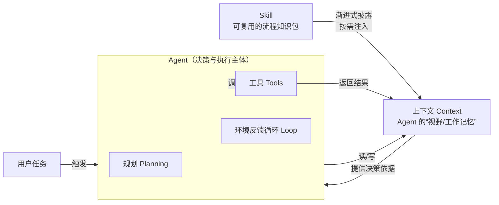

# Agent、上下文、Skill 三者之间的关系

这三个概念不是并列的三件事，而是一条「工作链」上的三个环节：**Agent 是干活的主体，上下文是它看世界的窗口，Skill 是给它注入专业能力的可复用知识包。**

## 一句话概括

- **Agent**：会自主决策、调用工具完成任务的主体。
- **上下文（Context）**：Agent 在每一步「能看到的全部信息」，是它决策的唯一现场依据。
- **Skill**：把可复用的流程知识固化成文件，按需注入上下文，让通用 Agent 变成领域专家。

## 关系总览

## 核心关系拆解

| 关系 | 说明 |
|------|------|
| 上下文 → Agent | 上下文是 Agent 的「视野」。Agent 的所有规划、工具选择、判断，都只能基于当下上下文里的信息（系统提示、历史、工具结果、检索片段）。上下文窗口的大小与质量，直接决定 Agent 能同时「看到」多少、想得多准。 |
| Skill → 上下文 | Skill 通过「渐进式披露」把自己按需注入上下文：平时只占极小的一段元数据（name + description），等任务相关时再加载正文和引用文件。这样 Skill 能在**不挤爆上下文**的前提下，给 Agent 几乎无限的领域知识。 |
| Skill → Agent | Skill 让通用 Agent「专业化」。它沉淀的是「反复会用到」的流程与规范，把一次性 prompt 变成可复用、可组合、可跨会话使用的能力单元。 |

## 重点：上下文如何影响 Agent 的工作

1. **视野上限**：上下文窗口限制了 Agent 一次能持有的信息量。任务越长（多轮对话、大量工具结果），越容易触顶，导致「丢信息」或「遗忘前文」。
2. **位置敏感**：即便没超限，模型对上下文中间位置的关注也可能下降（「Lost in the Middle」），所以把关键信息放对位置很重要。
3. **成本与速度**：上下文越长，每次调用越贵越慢；Agent 反复循环会让 token 消耗被放大。
4. **污染风险**：上下文里的外部内容（工具返回、网页）可能被「提示注入」污染，误导 Agent 的决策。

Skill 正是针对第 1、3 点的解法：用「按需加载」替代「一次性塞满」，让 Agent 在有限上下文里仍能拥有足够专业度。

## 重点：Skill 如何沉淀可复用的任务知识

- **把「隐性经验」变「显性文件」**：把「我每次都这么讲概念」固化成 `SKILL.md` 里的步骤和自检项。
- **一次编写，反复调用**：本仓库的 `concept-learner` 可用于学习任何概念，而不是只为本次三个概念写死。
- **渐进式披露，控制 token**：元数据常驻、正文按需、引用文件更深层按需，知识量大也不拖累上下文。
- **可组合、可迭代**：Skill 目录可带脚本和参考资料，后续课程项目可以在此基础上继续加新 Skill、加新资料。

## 一句话总结

> Agent 用「上下文」看世界，用「工具」改造世界；而「Skill」负责把可复用的专业知识，以最低的上下文代价，装进 Agent 的脑袋里。
